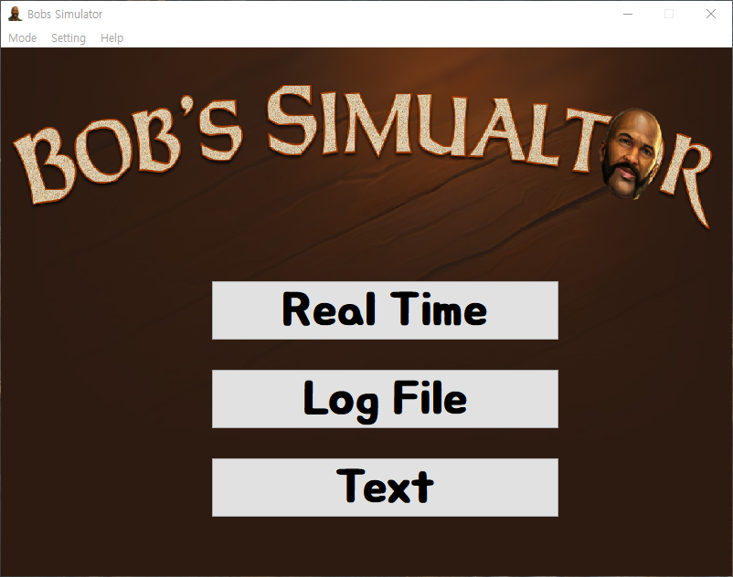
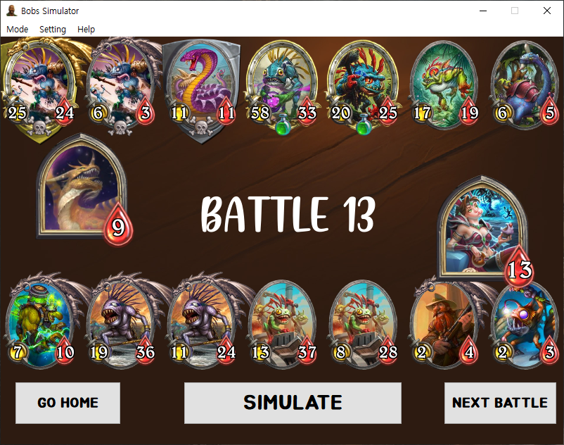
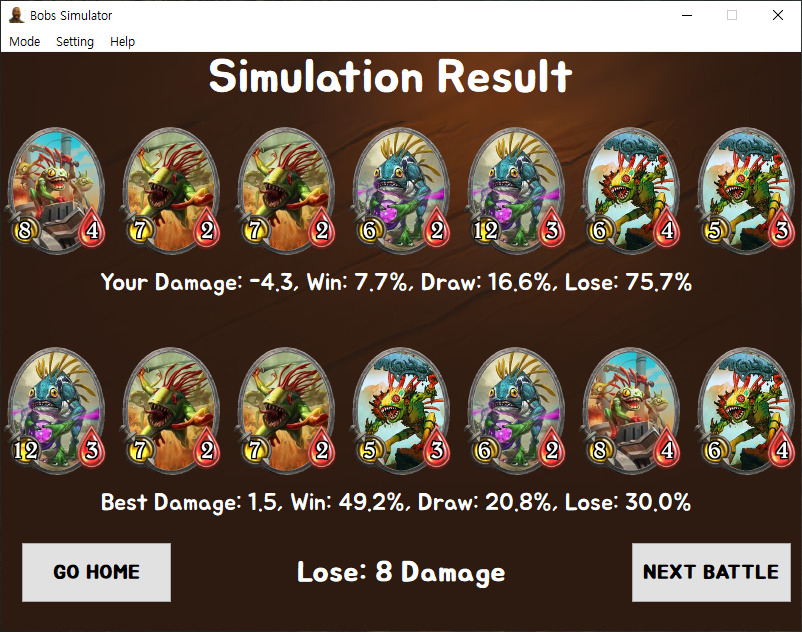

# BobsSimulator
### Simulate HearthStone Battleground and Calculate Your Win Rate.
#### Example Images



<br>

# How To Run

### Download and Unzip
https://drive.google.com/open?id=1IjYX8rz81Y3IE-C_AjgMTUJdxG0EX8oX
### Run BobsSimulator.exe
<br>

# How To Build

### 0. Download Project Files

### 1. Install python3.8<br>
https://www.python.org/ftp/python/3.8.2/python-3.8.2.exe

### 2. Make venv<br>
(open cmd in project root)
```
python -m venv venv
```
### 3. Install packages<br>
```
call venv/scripts/activate
easy_install -U pip
pip install --upgrade pip setuptools wheel
pip install --upgrade PySide2
pip install --upgrade xmltodict
pip install --upgrade hearthstone
pip install --upgrade hearthstone-data
pip install https://github.com/pyinstaller/pyinstaller/archive/develop.tar.gz
```
### 4. Run build.bat<br>
Before run build.bat, I recommend to exclude project directory in your anti-virus program. <br>
This is known error - https://stackoverflow.com/questions/43777106/program-made-with-pyinstaller-now-seen-as-a-trojan-horse-by-avg
